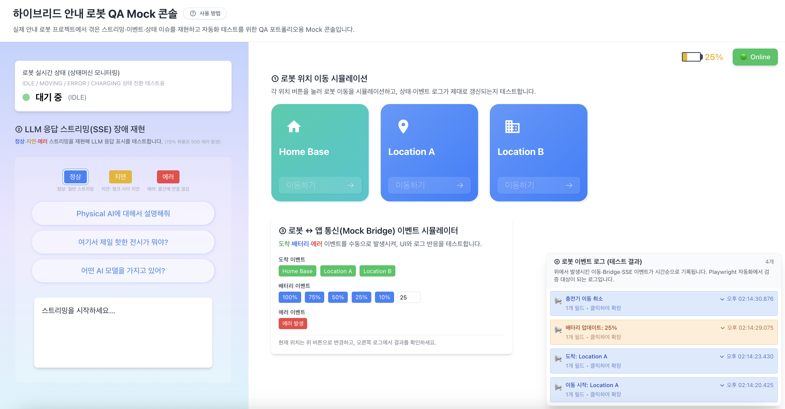

# 하이브리드 안내 로봇 QA Mock 콘솔

## 프로젝트 소개

실제 Temi 안내 로봇 프로젝트에서 겪은 스트리밍·이벤트·상태 이슈를 재현하고, 자동화 테스트를 위한 QA 포트폴리오용 Mock 콘솔입니다. 브라우저에서 실제 장애 패턴을 재현하여 UI와 로그 반응을 검증할 수 있습니다.

---

## 화면 구성 vs 실제 이슈 매핑

| UI 영역                                | 실제 프로젝트에서 겪은 이슈                                                                                               | Mock에서의 목적                                                              | 자동화 테스트 포인트                                                                     |
| -------------------------------------- | ------------------------------------------------------------------------------------------------------------------------- | ---------------------------------------------------------------------------- | ---------------------------------------------------------------------------------------- |
| **① 로봇 실시간 상태 카드**            | 로봇의 실제 상태와 UI/로그 상태 불일치 (예: IDLE로 표시되지만 실제로는 MOVING)                                            | 상태머신(IDLE / MOVING / ERROR / CHARGING)을 항상 기준점으로 일관 표시       | 이벤트 전후 상태 일관성 검증, 잘못된 상태 전환 방지                                      |
| **② LLM 응답 스트리밍(SSE) 장애 재현** | SSE 응답이 지연·누락·중복·500 에러로 인해 잘리거나 섞임, onPremise환경에서 작동하는 로봇이었기에 네트워크 이슈가 치명적임 | 버튼 몇 개로 스트리밍 장애 패턴을 재현하여 UI가 깨지는 모습과 복구 과정 관찰 | 정상/지연/에러 모드별 메시지 표시, 로딩/에러 UI, 연결 끊김 후 재요청 동작                |
| **③ 로봇 ↔ 앱 통신(Mock Bridge)**      | 도착·배터리·에러 이벤트가 중복/누락되어 운영자가 잘못된 판단                                                              | 실제 SDK 없이 도착/배터리/에러 이벤트를 수동으로 조합하여 시나리오 테스트    | 특정 순서/조합(예: 도착 후 배터리 10%)에서 상태/로그 일관성 확인                         |
| **④ 로봇 이벤트 로그**                 | 로그 정보가 부족하여 장애 원인 분석이 어려움                                                                              | 이동/SSE/Bridge 이벤트를 단일 타임라인으로 수집·기록                         | 각 이벤트가 올바른 타입/파라미터로 기록되는지, 최신 이벤트가 항상 상단에 표시되는지 확인 |

---

## 왜 이 4가지만 살렸는지

| 포함/제외 | 항목                                            | 결정 이유                                                                                  |
| --------- | ----------------------------------------------- | ------------------------------------------------------------------------------------------ |
| **포함**  | 상태머신 / SSE / Bridge 이벤트 / 로그           | Temi 프로젝트에서 실제로 장애·오작동이 가장 많이 발생했던 구간이라 리스크 기반으로 집중 👏 |
| 제외      | 로그인/권한/사용자 CRUD                         | 일반 웹 서비스와 유사하고, 로봇 도메인 특성이 희석되기 때문에 포폴 메시지에 도움이 적음    |
| 제외      | 실제 LLM, STT/TTS, 음성 인식                    | 외부 서비스 의존성이 크고, 테스트 재현이 어려워 QA 포폴에서 통제하기 힘든 영역             |
| 제외      | 복잡한 비즈니스 플로우 (예약, 시나리오 편집 등) | 화면은 화려해지지만, 테스트 전략·리스크 설명이 흐려져서 과감히 범위 밖으로 설정            |

**복잡한 건 다 빼고, 사고 나기 좋은 구간만 남겼습니다.**

---

### 사용 방법

1. **로봇 이동**: 위치 버튼을 눌러 로봇 이동을 시뮬레이션
2. ** 스트리밍**: 질문 선택 → 모드(정상/지연/에러) 선택 → 스트리밍 시작
3. **Bridge 이벤트**: Mock Bridge Control에서 도착/배터리/에러 이벤트 수동 트리거
4. **이벤트 로그**: 우측 하단 패널에서 모든 이벤트를 타임라인으로 확인

---

## 기술 스택

- **Frontend**: React 18, TypeScript, Vite, Recoil, Tailwind CSS
- **Mock Server**: Express, TypeScript, Server-Sent Events (SSE)
